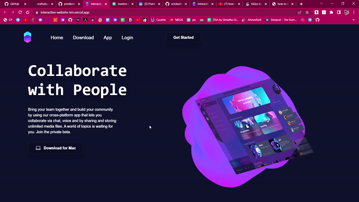

# Animated website interface

## Authors

- [@pratiksrivastava01](https://www.github.com/pratiksrivastava01)

## 🚀 About Me

I am a 🎓🎓 first-year 🧑‍🔬🧑‍🔬 B.Tech undergraduate with an interest in 🧑‍💻🧑‍💻 Software Engineering. Looking for a platform where I can enhance my development and 🤹🤹 programming skills. Interested in web development, competitive programming, and data structures and algorithm. Learning new technologies and frameworks coupled with different projects for my further development

**This is how the interface of the website look in dynamic mode**

**This is the representation of the website in the dyamic mode**

## 🔗 Links

**Follow me 👇👇**

## Tech Stack Used

**Client:** React JS

**Animation:** Spline Animation
